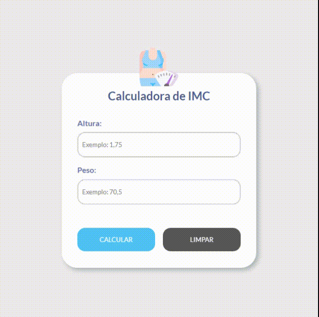

<h1 align="center">Calculadora de IMC</h1>

Calculadora de IMC (Índice de Massa Corporal) desenvolvido em JavaScript 

  <a href="#-projeto">Projeto</a>&nbsp;&nbsp;&nbsp;|&nbsp;&nbsp;&nbsp;
  <a href="#-tecnologias">Tecnologias</a>

 

  

## 💻 Projeto

Cálculo de IMC em JavaScript com base nos parâmetros internacionais definidos pela Organização Mundial de Saúde.

## 🚀 Tecnologias

Esse projeto foi desenvolvido com as seguintes tecnologias:

- HTML
- CSS
- JavaScript
---
 

Feito com 💛 por [Aylmer Bolzan](https://www.linkedin.com/in/aylmerbolzan/).